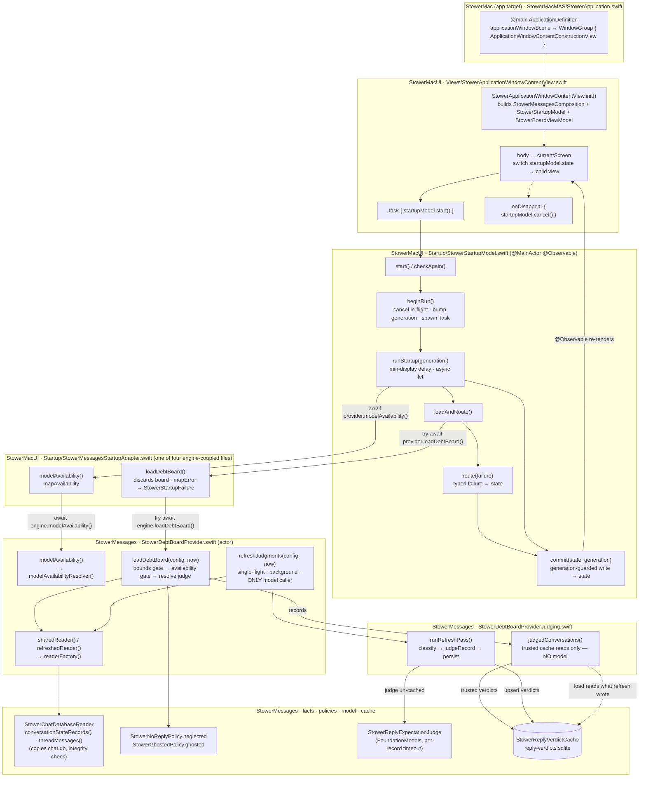
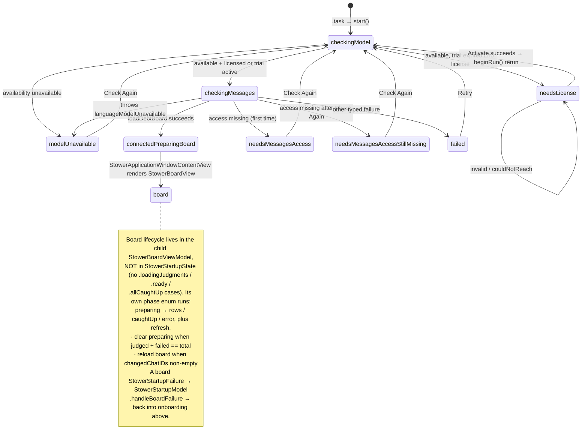
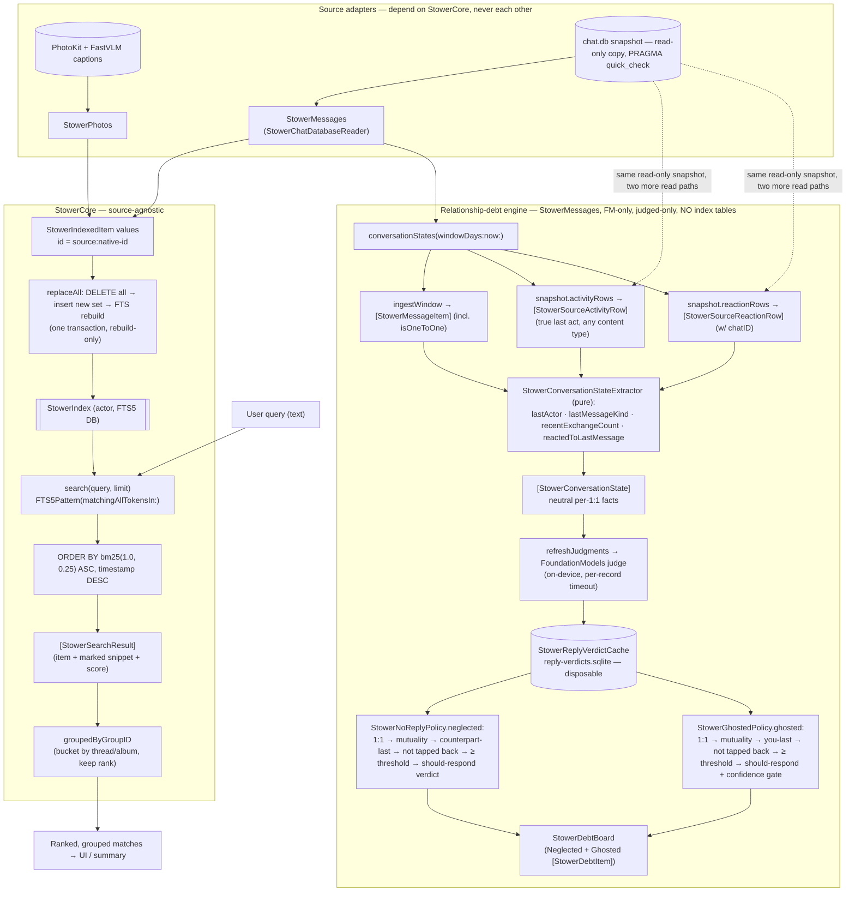
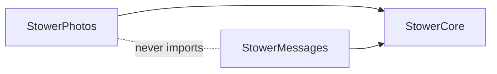

# Stower — Architecture at a glance

Diagrams, top to bottom: **the runtime lifecycle** (app launch → startup flow →
engine → background refresh), **how a query flows through the system today**, and
**the tables**. For the full per-table column detail and ownership/status notes,
see [`Docs/DataModel.md`](Docs/DataModel.md); this file is the bird's-eye view.

## Runtime lifecycle — launch, startup flow, and the engine

Two views of the same machine: a **call graph** (who calls whom, by file) and a
**state machine** (how the UI moves through screens and keeps running). The app
target imports only `StowerMacUI`; exactly four engine-coupled files —
`StowerMessagesStartupAdapter`, `StowerLiveBoardDataSource`,
`StowerMessagesComposition`, and `StowerMessagesMapping` — import the
`StowerMessages` engine (enforced by `precheck.sh` 6b). They are the
anti-corruption boundary that maps engine types to app-owned `StowerStartup*` /
`StowerBoard*` types; `StowerMessagesComposition` builds ONE
`StowerDebtBoardProvider` and injects it into both the startup adapter and the
board adapter, so the reader, verdict cache, and refresh coalescing are shared.

The **Application Window** is the runtime `NSWindow` realized from
`ApplicationDefinition.applicationWindowScene`'s `WindowGroup`; the term names the
window's product role, not a single-instance cardinality guarantee. Its changing
content is `StowerApplicationWindowContentView`, which selects one `currentScreen`
per `StowerStartupState`.

### Call graph — who calls whom on startup



The load path (`loadDebtBoard` → `judgedConversations`) **never runs the model**;
it serves only conversations a trusted verdict is already cached for. The
background `refreshJudgments` → `runRefreshPass` is the **only** model caller and
the **only** cache writer. The two never call each other — they communicate
through `StowerReplyVerdictCache` and the returned `StowerRefreshSummary`. That is
what lets the load return at structural speed and never block on the model.

### State machine — how the UI moves and keeps running



The **license gate** sits between model-availability and the board load: once the
model is available, `runStartup` reads `licenseGate.licenseState(now:)` — the
wired gate is `StowerLemonSqueezyLicenseGate`, a pure local read of the
plaintext `UserDefaults`-backed `StowerLicenseStore`, falling back to the local
7-day `StowerTrialClock` when no license is stored. `.licensed`/`.trial` both
route straight to `checkingMessages`; `.expired` routes to the entry screen
as `.needsLicense(nil)` (the error slot only carries `.invalid` /
`.couldNotReach` after a failed Activate attempt). The user pastes a key
there and taps Activate, which calls `StowerLemonSqueezyLicenseGate.activate(key:)`
— the app's only network call, a direct `POST` to Lemon Squeezy's
`/v1/licenses/activate` — and on success persists the key/instance id locally
and reruns startup via `beginRun()`: back through `checkingModel`, then into
`checkingMessages` once the license reads as active.

Every transition runs under a **generation token**: `beginRun()` bumps a counter,
and `commit` writes `state` only if the completing run is still the current
generation — so an overlapping Check Again can never let a stale load overwrite a
newer run, and a `CancellationError` (superseded run, or `onDisappear → cancel()`)
routes to nothing, never to `.failed`. The view re-renders because
`StowerStartupModel` is `@Observable` and `body` reads `startupModel.state`.

**How it "keeps running":** the startup flow is a one-shot that hands off at
`connectedPreparingBoard`, where `StowerApplicationWindowContentView` renders `StowerBoardView` backed
by a child `StowerBoardViewModel`. `StowerStartupState` still has no board-era
cases — the board's richer lifecycle (preparing → rows / caught-up / error, plus
the background `refreshJudgments` loop that backfills verdicts and drives the
spinner/reload signals off `StowerRefreshSummary`) lives in the view-model's own
phase enum, not the startup enum. A board load that surfaces a
`StowerStartupFailure` (e.g. a mid-session messages-access loss) re-enters onboarding via
`StowerStartupModel.handleBoardFailure`, so failure routing stays unified.

## System flow — ingest, query, and the relationship-debt engine



The relationship-debt engine is **FoundationModels-only** and **judged-only**: a
conversation reaches the Neglected or Ghosted list only once the on-device model
has judged it and a trusted verdict is cached — unjudged conversations stay
invisible, and there is **no heuristic fallback**. On a Mac that can't run the
model the engine throws `languageModelUnavailable(reason)` (checked at startup via
`modelAvailability()`, before `loadDebtBoard` opens `chat.db`); the app routes to
an onboarding or unsupported screen rather than degrading to a heuristic board.
`loadDebtBoard` returns at structural speed from the cache and never runs the
model; `refreshJudgments` is the background pass that judges and backfills the
cache, reporting `judged`/`failed`/`total` and which chats changed.

## The tables (condensed)

There is **no database literally named "index."** The persistent search database
is the one the `StowerIndex` actor manages (caller-supplied file path; in-memory
in tests) and it holds the three tables below. The `chat.db` **snapshot** is a
throwaway temp copy of Apple's data. `llm_trace` is design-only (not built). The
relationship-debt engine writes no index tables; its only state is the disposable
`StowerReplyVerdictCache` (`reply-verdicts.sqlite`), which holds nothing but input
hashes and model verdicts and can be deleted at any time.

Each table's first row is a **LIFECYCLE** marker:
- `PERSISTENT_REBUILDABLE` — survives across runs; erased + rebuilt from sources on a `schema_version` bump.
- `TEMPORARY` — ephemeral file; deleted on release, swept after 1 day.
- `NOT_BUILT` — design anchor only.

```mermaid
erDiagram
    meta {
        LIFECYCLE _ "PERSISTENT_REBUILDABLE (StowerIndex DB)"
        text key   PK "schema_version"
        text value
    }
    item {
        LIFECYCLE _ "PERSISTENT_REBUILDABLE (StowerIndex DB)"
        text   id          PK "source:native-id"
        text   source
        text   text           "FTS weight 1.0"
        double timestamp      "tiebreak DESC"
        text   deep_link
        text   group_id       "grouping key"
        text   group_title    "FTS weight 0.25"
        text   metadata       "JSON"
    }
    item_fts {
        LIFECYCLE _ "PERSISTENT_REBUILDABLE (StowerIndex DB)"
        text text
        text group_title
    }
    snapshot_chat_db {
        LIFECYCLE _ "TEMPORARY — stower-msg-UUID/chat.db, deleted on release"
        note _ "read-only copy of Apple's chat.db (message/chat/handle/joins)"
    }
    item ||--|| item_fts : "external-content, bm25(1.0, 0.25)"
    snapshot_chat_db ..> item : "read by adapters → derived into"
```

> `meta` / `item` / `item_fts` are the **only persistent tables Stower owns**.
> `snapshot_chat_db` is Apple's data, temporary and read-only — its full columns
> (`message` / `chat` / `handle` / join tables) and the design-only `llm_trace`
> are in [`Docs/DataModel.md`](Docs/DataModel.md).

## The one-directional dependency rule



Arrows point **into** `StowerCore`. Nothing depends on the adapters, and the two
adapters never import each other — that's what keeps the future Photos-only iOS
app from ever linking the Messages code (`AGENTS.md` §Architecture rules).
