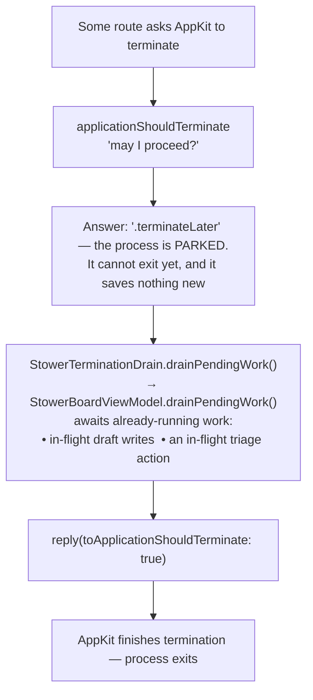
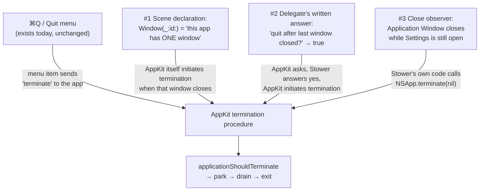

# How Stower quits

A plain-language map of every way the Stower process can end, what happens between "quit
requested" and "process exits," and why no route is allowed to skip that middle part. Written
for a human building intuition, not for the compiler — exact contracts live in
`Docs/MacAppContract.md` §10; this doc explains the flow and relationships.

## The one idea everything else hangs off

**Nobody quits the app directly.** Every route — a menu item, a window closing, Stower's own
code — merely *asks* AppKit (macOS's application framework) to terminate. AppKit's termination
procedure then consults a checkpoint before honoring the request:
`ApplicationLifecycleDelegate.applicationShouldTerminate` in
`StowerMac/StowerMacMAS/StowerApplication.swift`. Because the checkpoint is part of AppKit's
own quit sequence, no route can route around it. That is the design's safety: the drain does
not need to know *why* the app is quitting, because it always runs first.

## What the checkpoint does: park, drain, release

**The drain is a drain, not a save.** Draft text reaches SQLite on every keystroke
(`setDraft` → `enqueueDraftWrite` → `draftStore.upsert`), so by the time a quit is requested
the data is already on disk or milliseconds from it. `drainPendingWork()` writes nothing — it
awaits the writes (and any triage action) that were already running, which is why the park
lasts milliseconds, not seconds. It finishes sentences, it does not write the essay.

## The routes into the checkpoint

### Today (as built)

One route: **explicit termination** — ⌘Q, the app menu's Quit item, or anything else that
sends AppKit a terminate request. Closing the Application Window does **not** quit today: the
scene is a `WindowGroup`, so macOS assumes another window might be opened and leaves the
process running, windowless, with no menu-bar item to bring it back. App Review rejected
Stower for exactly this state, which is what the planned work below removes.

### Planned (window-menu structure outline, task `add-window-menu-to-reopen-main-application-window`)

Three additional mechanisms make closing the Application Window a quit. They are deliberately
redundant, and all of them still end at the same checkpoint:

How to hold the three in your head:

- **#1 and #2 are the same rule stated twice** — "closing the last window quits." #1 is
  *implied* by declaring the window single-instance (`Window(_:id:)` instead of `WindowGroup`);
  the platform does the quitting. #2 writes the intent into Stower's own source
  (`applicationShouldTerminateAfterLastWindowClosed` returning `true` on
  `ApplicationLifecycleDelegate`), so the behavior is explicit, greppable, and guarded rather
  than resting on a scene type's implicit semantics.
- **#3 exists for the one case the rule misses.** Settings (⌘,) is also an `NSWindow`, so
  closing the Application Window while Settings is open is *not* a last-window close — #1 and
  #2 stay silent. The observer subscribes to window-close notifications, recognizes the
  Application Window, and requests termination itself. Settings then closes as a consequence
  of quitting, which is safe because Settings holds no unsaved state (its one toggle writes
  through the instant it flips).

## The hazard on the drain path

The drain reaches the board through a closure registered by
`StowerApplicationWindowContentView` (`registerDrain`). Today that closure captures the board
model **weakly** — a reference that does not keep the model alive. That is safe while every
quit begins with the window open (⌘Q), but the planned close-to-quit routes tear the window's
view tree down *first*, deallocating the model, turning the drain into a silent no-op: the
process exits instantly, possibly mid-write, and looks identical to a correct quit. The
outline's prerequisite fix makes the capture strong so the drain's target lives as long as the
delegate — the process itself. Until that fix lands, the close-to-quit mechanisms must not.

## What this doc is not

- Not the contract: `Docs/MacAppContract.md` §10 is canonical for scene/lifecycle behavior.
- Not a status report: the "planned" section describes the accepted structure outline, whose
  runtime assumptions (window identifier behavior, Dock-icon restore, Window-menu
  auto-population) are verified by its Phase 1 checklist before any of it is trusted.
